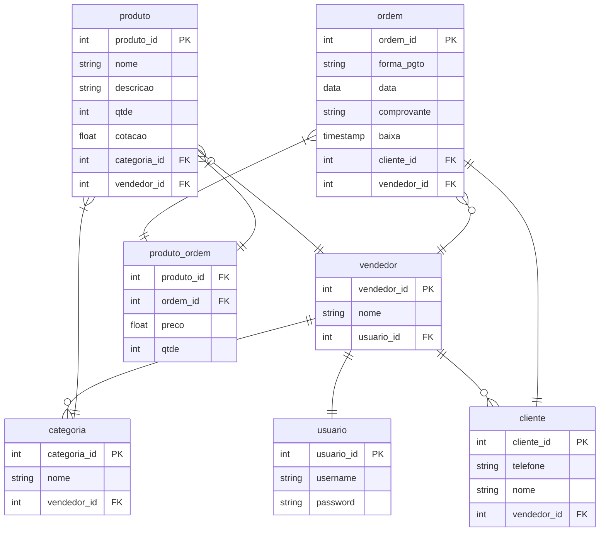

# Modelo Relacional

## Modelagem

O modelo relacional abaixo ilustra as entidades envolvidas na versão inicial do sistema

## Comentários

A ordem de compra pode conter mais de um produto, e um produto pode estar em várias ordens de compra. Além disso, o preço do produto cadastrado pelo vendedor na ordem de compra pode não ser a cotação que está registrada no produto, pois esse valor pode ser negociado. Então, a tabela de cruzamento `produto_ordem` foi criada para conter o preço que o produto foi vendido.

O atributo `vendedor_id` está presente em tabelas como `categoria`, `cliente` e `ordem` porque, pensando em um sistema com vários usuários, um vendedor não pode ver as categorias, clientes e ordens de compra cadastradas pelos outros vendedores.
