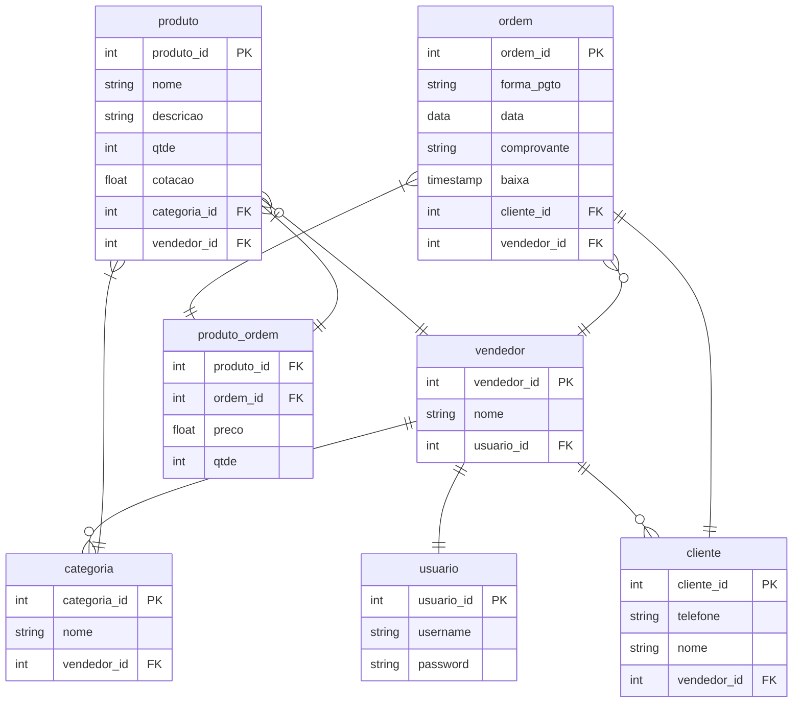

# Modelo Entidade Relacionamento

```mermaid

erDiagram
    usuario {
        int usuario_id PK
        string username
        string password
    }

    vendedor {
        int vendedor_id PK
        string nome
        int usuario_id FK
    }

    vendedor ||--|| usuario : ""

    categoria {
        int categoria_id PK
        string nome
        int vendedor_id FK
    }

    vendedor ||--o{ categoria : ""
    vendedor ||--o{ cliente : ""

    produto {
        int produto_id PK
        string nome
        string descricao
        int qtde
        float cotacao

        int categoria_id FK
        int vendedor_id FK
    }

    produto }|--|| categoria : ""
    produto }o--|| vendedor : ""

    cliente {
        int cliente_id PK
        string telefone
        string nome
        int vendedor_id FK
    }

    ordem {
        int ordem_id PK
        string forma_pgto
        data data
        string comprovante
        timestamp baixa
        int cliente_id FK
        int vendedor_id FK
    }

    ordem ||--|| cliente : ""
    ordem }o--|| vendedor : ""
    ordem  }|--|| produto_ordem : ""
    produto }|--|| produto_ordem : ""

    produto_ordem {
        int produto_id FK
        int ordem_id FK
        float preco
        int qtde
    }


```